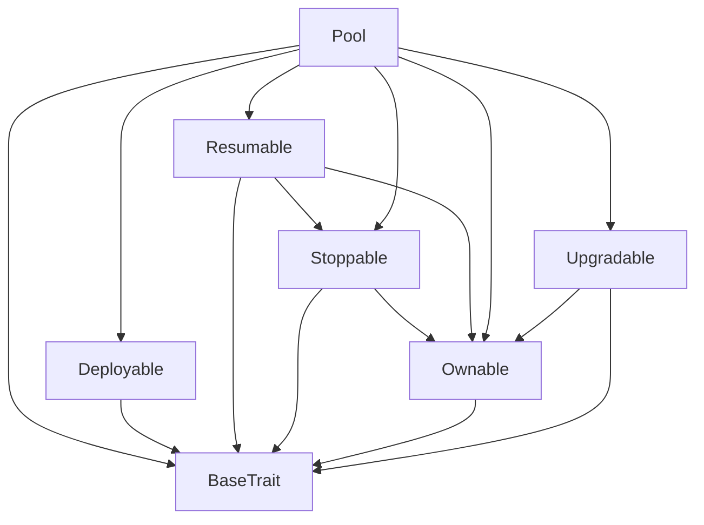
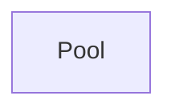

# TACT Compilation Report
Contract: Pool
BOC Size: 24573 bytes

# Types
Total Types: 72

## StateInit
TLB: `_ code:^cell data:^cell = StateInit`
Signature: `StateInit{code:^cell,data:^cell}`

## StdAddress
TLB: `_ workchain:int8 address:uint256 = StdAddress`
Signature: `StdAddress{workchain:int8,address:uint256}`

## VarAddress
TLB: `_ workchain:int32 address:^slice = VarAddress`
Signature: `VarAddress{workchain:int32,address:^slice}`

## Context
TLB: `_ bounced:bool sender:address value:int257 raw:^slice = Context`
Signature: `Context{bounced:bool,sender:address,value:int257,raw:^slice}`

## SendParameters
TLB: `_ bounce:bool to:address value:int257 mode:int257 body:Maybe ^cell code:Maybe ^cell data:Maybe ^cell = SendParameters`
Signature: `SendParameters{bounce:bool,to:address,value:int257,mode:int257,body:Maybe ^cell,code:Maybe ^cell,data:Maybe ^cell}`

## Deploy
TLB: `deploy#946a98b6 queryId:uint64 = Deploy`
Signature: `Deploy{queryId:uint64}`

## DeployOk
TLB: `deploy_ok#aff90f57 queryId:uint64 = DeployOk`
Signature: `DeployOk{queryId:uint64}`

## FactoryDeploy
TLB: `factory_deploy#6d0ff13b queryId:uint64 cashback:address = FactoryDeploy`
Signature: `FactoryDeploy{queryId:uint64,cashback:address}`

## ChangeOwner
TLB: `change_owner#819dbe99 queryId:uint64 newOwner:address = ChangeOwner`
Signature: `ChangeOwner{queryId:uint64,newOwner:address}`

## ChangeOwnerOk
TLB: `change_owner_ok#327b2b4a queryId:uint64 newOwner:address = ChangeOwnerOk`
Signature: `ChangeOwnerOk{queryId:uint64,newOwner:address}`

## RequestUpgrade
TLB: `request_upgrade#82470fd8 code:^slice data:Maybe ^slice = RequestUpgrade`
Signature: `RequestUpgrade{code:^slice,data:Maybe ^slice}`

## ExecuteUpgrade
TLB: `execute_upgrade#3f8f70d6 seqno:uint32 = ExecuteUpgrade`
Signature: `ExecuteUpgrade{seqno:uint32}`

## CancelUpgrade
TLB: `cancel_upgrade#dfbc237e seqno:uint32 = CancelUpgrade`
Signature: `CancelUpgrade{seqno:uint32}`

## UpgradeRequest
TLB: `_ code:^slice data:Maybe ^slice unlockTime:uint32 = UpgradeRequest`
Signature: `UpgradeRequest{code:^slice,data:Maybe ^slice,unlockTime:uint32}`

## JettonTransfer
TLB: `jetton_transfer#0f8a7ea5 query_id:uint64 amount:coins destination:address response_destination:Maybe address custom_payload:Maybe ^cell forward_ton_amount:coins forward_payload:remainder<slice> = JettonTransfer`
Signature: `JettonTransfer{query_id:uint64,amount:coins,destination:address,response_destination:Maybe address,custom_payload:Maybe ^cell,forward_ton_amount:coins,forward_payload:remainder<slice>}`

## JettonTransferNotification
TLB: `jetton_transfer_notification#7362d09c query_id:uint64 amount:coins sender:address forward_payload:remainder<slice> = JettonTransferNotification`
Signature: `JettonTransferNotification{query_id:uint64,amount:coins,sender:address,forward_payload:remainder<slice>}`

## JettonBurn
TLB: `jetton_burn#595f07bc query_id:uint64 amount:coins response_destination:address custom_payload:Maybe ^cell = JettonBurn`
Signature: `JettonBurn{query_id:uint64,amount:coins,response_destination:address,custom_payload:Maybe ^cell}`

## JettonMint
TLB: `jetton_mint#89b71d09 origin:address receiver:address amount:int257 custom_payload:Maybe ^cell forward_ton_amount:coins forward_payload:remainder<slice> = JettonMint`
Signature: `JettonMint{origin:address,receiver:address,amount:int257,custom_payload:Maybe ^cell,forward_ton_amount:coins,forward_payload:remainder<slice>}`

## JettonUpdateContent
TLB: `jetton_update_content#5b8f271d jetton_content:^cell = JettonUpdateContent`
Signature: `JettonUpdateContent{jetton_content:^cell}`

## UpdateBaseConfig
TLB: `update_base_config#d05e72b3 gasConfig:Maybe GasConfig{mintJettonGas:coins,burnJettonGas:coins,transferJettonGas:coins,createPerpOrderGas:coins,cancelPerpOrderGas:coins,executePerpOrderGas:coins,createLiquidityOrderGas:coins,cancelLiquidityOrderGas:coins,executeLiquidityOrderGas:coins,minStorageReserve:coins,lpMinExecutionFee:coins,perpMinExecutionFee:coins} executorConfig:Maybe ExecutorConfig{executors:dict<address, bool>} contractConfig:Maybe ContractConfig{multisig:address,tlpJetton:address,tlpWallet:address} = UpdateBaseConfig`
Signature: `UpdateBaseConfig{gasConfig:Maybe GasConfig{mintJettonGas:coins,burnJettonGas:coins,transferJettonGas:coins,createPerpOrderGas:coins,cancelPerpOrderGas:coins,executePerpOrderGas:coins,createLiquidityOrderGas:coins,cancelLiquidityOrderGas:coins,executeLiquidityOrderGas:coins,minStorageReserve:coins,lpMinExecutionFee:coins,perpMinExecutionFee:coins},executorConfig:Maybe ExecutorConfig{executors:dict<address, bool>},contractConfig:Maybe ContractConfig{multisig:address,tlpJetton:address,tlpWallet:address}}`

## UpdatePoolConfig
TLB: `update_pool_config#a62f856c orderLockTime:uint32 maxLpNetCap:coins lpRolloverFeeRate:uint32 liquidatedPositionShareRate:uint32 normalPositionShareRate:uint32 = UpdatePoolConfig`
Signature: `UpdatePoolConfig{orderLockTime:uint32,maxLpNetCap:coins,lpRolloverFeeRate:uint32,liquidatedPositionShareRate:uint32,normalPositionShareRate:uint32}`

## SetManager
TLB: `set_manager#c8c03c88 manager:address compensator:address claimer:address = SetManager`
Signature: `SetManager{manager:address,compensator:address,claimer:address}`

## ListToken
TLB: `list_token#e49b3bf0 tokenId:uint16 config:TokenConfig{name:^string,enable:bool,maxLeverage:uint16,liquidationFee:coins,maintenanceRate:uint32,tradingFeeRate:uint32,lpTradingFeeRate:uint32} = ListToken`
Signature: `ListToken{tokenId:uint16,config:TokenConfig{name:^string,enable:bool,maxLeverage:uint16,liquidationFee:coins,maintenanceRate:uint32,tradingFeeRate:uint32,lpTradingFeeRate:uint32}}`

## DelistToken
TLB: `delist_token#9b42e4ef tokenId:uint16 = DelistToken`
Signature: `DelistToken{tokenId:uint16}`

## WithdrawFee
TLB: `withdraw_fee#8fe2e211 feeReceiver:Maybe address = WithdrawFee`
Signature: `WithdrawFee{feeReceiver:Maybe address}`

## FeedPrices
TLB: `feed_prices#90cb4c4b trxId:uint64 lpFundingFeeGrowth:coins rolloverFeeGrowth:coins prices:dict<uint16, uint128> = FeedPrices`
Signature: `FeedPrices{trxId:uint64,lpFundingFeeGrowth:coins,rolloverFeeGrowth:coins,prices:dict<uint16, uint128>}`

## IncreaseAum
TLB: `increase_aum#0ea2a5cf trxId:uint64 amount:coins = IncreaseAum`
Signature: `IncreaseAum{trxId:uint64,amount:coins}`

## CancelLiquidityOrder
TLB: `cancel_liquidity_order#69ef6dfe orderId:uint64 trxId:uint64 = CancelLiquidityOrder`
Signature: `CancelLiquidityOrder{orderId:uint64,trxId:uint64}`

## ExecuteLiquidityOrder
TLB: `execute_liquidity_order#3156b508 orderId:uint64 trxId:uint64 prices:dict<uint16, uint128> lpFundingFeeGrowth:coins rolloverFeeGrowth:coins = ExecuteLiquidityOrder`
Signature: `ExecuteLiquidityOrder{orderId:uint64,trxId:uint64,prices:dict<uint16, uint128>,lpFundingFeeGrowth:coins,rolloverFeeGrowth:coins}`

## CreateIncreasePerpOrder
TLB: `create_increase_perp_order#903f9f96 trxId:uint64 tokenId:uint16 isLong:bool isMarket:bool marginDelta:coins sizeDelta:coins triggerPrice:uint128 requestTime:uint32 executionFee:coins tpSize:coins tpPrice:coins slSize:coins slPrice:coins = CreateIncreasePerpOrder`
Signature: `CreateIncreasePerpOrder{trxId:uint64,tokenId:uint16,isLong:bool,isMarket:bool,marginDelta:coins,sizeDelta:coins,triggerPrice:uint128,requestTime:uint32,executionFee:coins,tpSize:coins,tpPrice:coins,slSize:coins,slPrice:coins}`

## CreateDecreasePerpOrder
TLB: `create_decrease_perp_order#cbbbd224 trxId:uint64 tokenId:uint16 isLong:bool marginDelta:coins sizeDelta:coins triggerPrice:uint128 requestTime:uint32 executionFee:coins = CreateDecreasePerpOrder`
Signature: `CreateDecreasePerpOrder{trxId:uint64,tokenId:uint16,isLong:bool,marginDelta:coins,sizeDelta:coins,triggerPrice:uint128,requestTime:uint32,executionFee:coins}`

## CreateTpSlPerpOrder
TLB: `create_tp_sl_perp_order#f94f80bb executionFee:coins tokenId:uint16 isLong:bool tpSize:coins tpPrice:uint128 slSize:coins slPrice:uint128 trxId:uint64 requestTime:uint32 = CreateTpSlPerpOrder`
Signature: `CreateTpSlPerpOrder{executionFee:coins,tokenId:uint16,isLong:bool,tpSize:coins,tpPrice:uint128,slSize:coins,slPrice:uint128,trxId:uint64,requestTime:uint32}`

## CancelPerpOrder
TLB: `cancel_perp_order#7d6aab59 orderId:uint64 trxId:uint64 = CancelPerpOrder`
Signature: `CancelPerpOrder{orderId:uint64,trxId:uint64}`

## ExecutePerpOrder
TLB: `execute_perp_order#04f5e01b orderId:uint64 trxId:uint64 tokenId:uint16 price:uint128 premiumRate:int32 fundingFeeGrowth:int128 rolloverFeeGrowth:int128 = ExecutePerpOrder`
Signature: `ExecutePerpOrder{orderId:uint64,trxId:uint64,tokenId:uint16,price:uint128,premiumRate:int32,fundingFeeGrowth:int128,rolloverFeeGrowth:int128}`

## LiquidatePerpPosition
TLB: `liquidate_perp_position#5695e93e tokenId:uint16 account:address isLong:bool trxId:uint64 price:uint128 premiumRate:int32 fundingFeeGrowth:int128 rolloverFeeGrowth:int128 = LiquidatePerpPosition`
Signature: `LiquidatePerpPosition{tokenId:uint16,account:address,isLong:bool,trxId:uint64,price:uint128,premiumRate:int32,fundingFeeGrowth:int128,rolloverFeeGrowth:int128}`

## ADLPerpPosition
TLB: `adl_perp_position#d5debfdc tokenId:uint16 account:address isLong:bool marginDelta:coins sizeDelta:coins trxId:uint64 price:uint128 premiumRate:int32 fundingFeeGrowth:int128 rolloverFeeGrowth:int128 = ADLPerpPosition`
Signature: `ADLPerpPosition{tokenId:uint16,account:address,isLong:bool,marginDelta:coins,sizeDelta:coins,trxId:uint64,price:uint128,premiumRate:int32,fundingFeeGrowth:int128,rolloverFeeGrowth:int128}`

## CreateCompensate
TLB: `create_compensate#fc33877d orderType:Maybe uint8 orderId:uint64 trxId:uint64 refundReceiver:Maybe address refundAmount:coins executionFeeReceiver:Maybe address executionFee:coins = CreateCompensate`
Signature: `CreateCompensate{orderType:Maybe uint8,orderId:uint64,trxId:uint64,refundReceiver:Maybe address,refundAmount:coins,executionFeeReceiver:Maybe address,executionFee:coins}`

## ExecuteOrCancelCompensate
TLB: `execute_or_cancel_compensate#88e7f927 isCancel:bool compensateId:uint64 trxId:uint64 = ExecuteOrCancelCompensate`
Signature: `ExecuteOrCancelCompensate{isCancel:bool,compensateId:uint64,trxId:uint64}`

## CreateAddLiquidityOrder
TLB: `create_add_liquidity_order#dea2fc31 trxId:uint64 amount:coins executionFee:coins = CreateAddLiquidityOrder`
Signature: `CreateAddLiquidityOrder{trxId:uint64,amount:coins,executionFee:coins}`

## LiquidityOrderCreatedEvent
TLB: `liquidity_order_created_event#40f2d8a3 opType:uint8 account:address amount:coins executionFee:coins orderId:uint64 trxId:uint64 = LiquidityOrderCreatedEvent`
Signature: `LiquidityOrderCreatedEvent{opType:uint8,account:address,amount:coins,executionFee:coins,orderId:uint64,trxId:uint64}`

## LiquidityOrderCancelledEvent
TLB: `liquidity_order_cancelled_event#b9b03cbc opType:uint8 orderId:uint64 trxId:uint64 = LiquidityOrderCancelledEvent`
Signature: `LiquidityOrderCancelledEvent{opType:uint8,orderId:uint64,trxId:uint64}`

## LiquidityPoolUpdatedEvent
TLB: `liquidity_pool_updated_event#24185cdf trxId:uint64 orderId:uint64 opType:uint8 account:address amount:coins tlpDelta:coins tlpPrice:uint128 tlpSupply:coins lpFundAfter:int128 realizedLpFundingFeeDelta:coins realizedLpRolloverFeeDelta:coins entryLpFundingFeeGrowth:coins entryRolloverFeeGrowth:coins = LiquidityPoolUpdatedEvent`
Signature: `LiquidityPoolUpdatedEvent{trxId:uint64,orderId:uint64,opType:uint8,account:address,amount:coins,tlpDelta:coins,tlpPrice:uint128,tlpSupply:coins,lpFundAfter:int128,realizedLpFundingFeeDelta:coins,realizedLpRolloverFeeDelta:coins,entryLpFundingFeeGrowth:coins,entryRolloverFeeGrowth:coins}`

## PerpOrderCreatedEvent
TLB: `perp_order_created_event#ad8e31ef opType:uint8 tokenId:uint16 account:address isLong:bool marginDelta:coins sizeDelta:coins triggerPrice:uint128 triggerAbove:bool executionFee:coins orderId:uint64 trxId:uint64 requestTime:uint32 = PerpOrderCreatedEvent`
Signature: `PerpOrderCreatedEvent{opType:uint8,tokenId:uint16,account:address,isLong:bool,marginDelta:coins,sizeDelta:coins,triggerPrice:uint128,triggerAbove:bool,executionFee:coins,orderId:uint64,trxId:uint64,requestTime:uint32}`

## PerpOrderCancelledEvent
TLB: `perp_order_cancelled_event#f2c5aeac opType:uint8 orderId:uint64 trxId:uint64 = PerpOrderCancelledEvent`
Signature: `PerpOrderCancelledEvent{opType:uint8,orderId:uint64,trxId:uint64}`

## PerpPositionIncreasedEvent
TLB: `perp_position_increased_event#47596abe trxId:uint64 orderId:uint64 opType:uint8 positionId:uint64 account:address tokenId:uint16 isLong:bool marginDelta:int128 marginAfter:coins sizeDelta:int128 sizeAfter:coins tradePrice:uint128 entryPrice:uint128 fundingFee:int128 rolloverFee:coins tradingFee:coins entryFundingFeeGrowthAfter:int128 entryRolloverFeeGrowthAfter:int128 globalLongMarginAfter:coins globalShortMarginAfter:coins globalLongSizeAfter:coins globalShortSizeAfter:coins globalLongValueAfter:coins globalShortValueAfter:coins lpNetSizeAfter:coins lpIsLong:bool lpEntryPriceAfter:uint128 lpFundAfter:int128 lpTradingFee:coins lpRealizedPnl:int128 = PerpPositionIncreasedEvent`
Signature: `PerpPositionIncreasedEvent{trxId:uint64,orderId:uint64,opType:uint8,positionId:uint64,account:address,tokenId:uint16,isLong:bool,marginDelta:int128,marginAfter:coins,sizeDelta:int128,sizeAfter:coins,tradePrice:uint128,entryPrice:uint128,fundingFee:int128,rolloverFee:coins,tradingFee:coins,entryFundingFeeGrowthAfter:int128,entryRolloverFeeGrowthAfter:int128,globalLongMarginAfter:coins,globalShortMarginAfter:coins,globalLongSizeAfter:coins,globalShortSizeAfter:coins,globalLongValueAfter:coins,globalShortValueAfter:coins,lpNetSizeAfter:coins,lpIsLong:bool,lpEntryPriceAfter:uint128,lpFundAfter:int128,lpTradingFee:coins,lpRealizedPnl:int128}`

## PerpPositionDecreasedEvent
TLB: `perp_position_decreased_event#2353464c trxId:uint64 orderId:uint64 opType:uint8 positionId:uint64 account:address tokenId:uint16 isLong:bool marginDelta:int128 marginAfter:coins sizeDelta:int128 sizeAfter:coins tradePrice:uint128 entryPrice:uint128 realizedPnLDelta:int128 fundingFee:int128 rolloverFee:coins tradingFee:coins entryFundingFeeGrowthAfter:int128 entryRolloverFeeGrowthAfter:int128 payout:coins globalLongMarginAfter:coins globalShortMarginAfter:coins globalLongSizeAfter:coins globalShortSizeAfter:coins globalLongValueAfter:coins globalShortValueAfter:coins lpNetSizeAfter:coins lpIsLong:bool lpEntryPriceAfter:uint128 lpFundAfter:int128 lpTradingFee:coins lpRealizedPnl:int128 = PerpPositionDecreasedEvent`
Signature: `PerpPositionDecreasedEvent{trxId:uint64,orderId:uint64,opType:uint8,positionId:uint64,account:address,tokenId:uint16,isLong:bool,marginDelta:int128,marginAfter:coins,sizeDelta:int128,sizeAfter:coins,tradePrice:uint128,entryPrice:uint128,realizedPnLDelta:int128,fundingFee:int128,rolloverFee:coins,tradingFee:coins,entryFundingFeeGrowthAfter:int128,entryRolloverFeeGrowthAfter:int128,payout:coins,globalLongMarginAfter:coins,globalShortMarginAfter:coins,globalLongSizeAfter:coins,globalShortSizeAfter:coins,globalLongValueAfter:coins,globalShortValueAfter:coins,lpNetSizeAfter:coins,lpIsLong:bool,lpEntryPriceAfter:uint128,lpFundAfter:int128,lpTradingFee:coins,lpRealizedPnl:int128}`

## CompensateCreatedEvent
TLB: `compensate_created_event#9628ba96 compensateId:uint64 orderType:Maybe uint8 orderId:uint64 trxId:uint64 refundReceiver:Maybe address refundAmount:coins executionFeeReceiver:Maybe address executionFee:coins unlockTime:uint32 = CompensateCreatedEvent`
Signature: `CompensateCreatedEvent{compensateId:uint64,orderType:Maybe uint8,orderId:uint64,trxId:uint64,refundReceiver:Maybe address,refundAmount:coins,executionFeeReceiver:Maybe address,executionFee:coins,unlockTime:uint32}`

## CompensateCancelledEvent
TLB: `compensate_cancelled_event#4bc341d5 compensateId:uint64 trxId:uint64 = CompensateCancelledEvent`
Signature: `CompensateCancelledEvent{compensateId:uint64,trxId:uint64}`

## CompensateExecutedEvent
TLB: `compensate_executed_event#db45e438 compensateId:uint64 trxId:uint64 = CompensateExecutedEvent`
Signature: `CompensateExecutedEvent{compensateId:uint64,trxId:uint64}`

## FeeChargedEvent
TLB: `fee_charged_event#7a53bc1b trxId:uint64 lpFundAfter:int128 realizedLpFundingFeeDelta:coins realizedLpRolloverFeeDelta:coins entryLpFundingFeeGrowth:coins entryRolloverFeeGrowth:coins = FeeChargedEvent`
Signature: `FeeChargedEvent{trxId:uint64,lpFundAfter:int128,realizedLpFundingFeeDelta:coins,realizedLpRolloverFeeDelta:coins,entryLpFundingFeeGrowth:coins,entryRolloverFeeGrowth:coins}`

## AumIncreasedEvent
TLB: `aum_increased_event#0a5f0ef8 trxId:uint64 amount:coins lpFundAfter:int128 = AumIncreasedEvent`
Signature: `AumIncreasedEvent{trxId:uint64,amount:coins,lpFundAfter:int128}`

## AccountInfo
TLB: `_ isExecutor:bool isCompensator:bool isClaimer:bool isManager:bool = AccountInfo`
Signature: `AccountInfo{isExecutor:bool,isCompensator:bool,isClaimer:bool,isManager:bool}`

## ConfigData
TLB: `_ orderLockTime:uint32 mintJettonGas:coins burnJettonGas:coins transferJettonGas:coins createPerpOrderGas:coins cancelPerpOrderGas:coins executePerpOrderGas:coins createLiquidityOrderGas:coins cancelLiquidityOrderGas:coins executeLiquidityOrderGas:coins minStorageReserve:coins lpMinExecutionFee:coins perpMinExecutionFee:coins tlpWallet:address tlpJetton:address maxLpNetCap:coins = ConfigData`
Signature: `ConfigData{orderLockTime:uint32,mintJettonGas:coins,burnJettonGas:coins,transferJettonGas:coins,createPerpOrderGas:coins,cancelPerpOrderGas:coins,executePerpOrderGas:coins,createLiquidityOrderGas:coins,cancelLiquidityOrderGas:coins,executeLiquidityOrderGas:coins,minStorageReserve:coins,lpMinExecutionFee:coins,perpMinExecutionFee:coins,tlpWallet:address,tlpJetton:address,maxLpNetCap:coins}`

## TokenConfig
TLB: `_ name:^string enable:bool maxLeverage:uint16 liquidationFee:coins maintenanceRate:uint32 tradingFeeRate:uint32 lpTradingFeeRate:uint32 = TokenConfig`
Signature: `TokenConfig{name:^string,enable:bool,maxLeverage:uint16,liquidationFee:coins,maintenanceRate:uint32,tradingFeeRate:uint32,lpTradingFeeRate:uint32}`

## PoolStat
TLB: `_ tlpSupply:coins orderAmountReserve:coins executionFeeReserve:coins feeReserve:coins globalLPFund:int128 globalLpFundingFeeGrowth:coins globalRolloverFeeGrowth:coins = PoolStat`
Signature: `PoolStat{tlpSupply:coins,orderAmountReserve:coins,executionFeeReserve:coins,feeReserve:coins,globalLPFund:int128,globalLpFundingFeeGrowth:coins,globalRolloverFeeGrowth:coins}`

## AccountPerpPosition
TLB: `_ positions:dict<address, ^DirectionPerpPosition{longPosition:PerpPosition{positionId:uint64,margin:coins,size:coins,entryPrice:uint128,entryFundingFeeGrowth:int128,entryRolloverFeeGrowth:int128},shortPosition:PerpPosition{positionId:uint64,margin:coins,size:coins,entryPrice:uint128,entryFundingFeeGrowth:int128,entryRolloverFeeGrowth:int128}}> = AccountPerpPosition`
Signature: `AccountPerpPosition{positions:dict<address, ^DirectionPerpPosition{longPosition:PerpPosition{positionId:uint64,margin:coins,size:coins,entryPrice:uint128,entryFundingFeeGrowth:int128,entryRolloverFeeGrowth:int128},shortPosition:PerpPosition{positionId:uint64,margin:coins,size:coins,entryPrice:uint128,entryFundingFeeGrowth:int128,entryRolloverFeeGrowth:int128}}>}`

## DirectionPerpPosition
TLB: `_ longPosition:PerpPosition{positionId:uint64,margin:coins,size:coins,entryPrice:uint128,entryFundingFeeGrowth:int128,entryRolloverFeeGrowth:int128} shortPosition:PerpPosition{positionId:uint64,margin:coins,size:coins,entryPrice:uint128,entryFundingFeeGrowth:int128,entryRolloverFeeGrowth:int128} = DirectionPerpPosition`
Signature: `DirectionPerpPosition{longPosition:PerpPosition{positionId:uint64,margin:coins,size:coins,entryPrice:uint128,entryFundingFeeGrowth:int128,entryRolloverFeeGrowth:int128},shortPosition:PerpPosition{positionId:uint64,margin:coins,size:coins,entryPrice:uint128,entryFundingFeeGrowth:int128,entryRolloverFeeGrowth:int128}}`

## PerpPosition
TLB: `_ positionId:uint64 margin:coins size:coins entryPrice:uint128 entryFundingFeeGrowth:int128 entryRolloverFeeGrowth:int128 = PerpPosition`
Signature: `PerpPosition{positionId:uint64,margin:coins,size:coins,entryPrice:uint128,entryFundingFeeGrowth:int128,entryRolloverFeeGrowth:int128}`

## GlobalLPPosition
TLB: `_ netSize:coins isLong:bool entryPrice:uint128 = GlobalLPPosition`
Signature: `GlobalLPPosition{netSize:coins,isLong:bool,entryPrice:uint128}`

## PerpPositionData
TLB: `_ perpPosition:Maybe DirectionPerpPosition{longPosition:PerpPosition{positionId:uint64,margin:coins,size:coins,entryPrice:uint128,entryFundingFeeGrowth:int128,entryRolloverFeeGrowth:int128},shortPosition:PerpPosition{positionId:uint64,margin:coins,size:coins,entryPrice:uint128,entryFundingFeeGrowth:int128,entryRolloverFeeGrowth:int128}} globalLPPosition:Maybe GlobalLPPosition{netSize:coins,isLong:bool,entryPrice:uint128} globalPosition:Maybe GlobalPosition{longMargin:coins,shortMargin:coins,longSize:coins,shortSize:coins,longValue:coins,shortValue:coins} = PerpPositionData`
Signature: `PerpPositionData{perpPosition:Maybe DirectionPerpPosition{longPosition:PerpPosition{positionId:uint64,margin:coins,size:coins,entryPrice:uint128,entryFundingFeeGrowth:int128,entryRolloverFeeGrowth:int128},shortPosition:PerpPosition{positionId:uint64,margin:coins,size:coins,entryPrice:uint128,entryFundingFeeGrowth:int128,entryRolloverFeeGrowth:int128}},globalLPPosition:Maybe GlobalLPPosition{netSize:coins,isLong:bool,entryPrice:uint128},globalPosition:Maybe GlobalPosition{longMargin:coins,shortMargin:coins,longSize:coins,shortSize:coins,longValue:coins,shortValue:coins}}`

## GlobalPosition
TLB: `_ longMargin:coins shortMargin:coins longSize:coins shortSize:coins longValue:coins shortValue:coins = GlobalPosition`
Signature: `GlobalPosition{longMargin:coins,shortMargin:coins,longSize:coins,shortSize:coins,longValue:coins,shortValue:coins}`

## GasConfig
TLB: `_ mintJettonGas:coins burnJettonGas:coins transferJettonGas:coins createPerpOrderGas:coins cancelPerpOrderGas:coins executePerpOrderGas:coins createLiquidityOrderGas:coins cancelLiquidityOrderGas:coins executeLiquidityOrderGas:coins minStorageReserve:coins lpMinExecutionFee:coins perpMinExecutionFee:coins = GasConfig`
Signature: `GasConfig{mintJettonGas:coins,burnJettonGas:coins,transferJettonGas:coins,createPerpOrderGas:coins,cancelPerpOrderGas:coins,executePerpOrderGas:coins,createLiquidityOrderGas:coins,cancelLiquidityOrderGas:coins,executeLiquidityOrderGas:coins,minStorageReserve:coins,lpMinExecutionFee:coins,perpMinExecutionFee:coins}`

## ExecutorConfig
TLB: `_ executors:dict<address, bool> = ExecutorConfig`
Signature: `ExecutorConfig{executors:dict<address, bool>}`

## ContractConfig
TLB: `_ multisig:address tlpJetton:address tlpWallet:address = ContractConfig`
Signature: `ContractConfig{multisig:address,tlpJetton:address,tlpWallet:address}`

## LiquidityOrder
TLB: `_ isIncrease:bool account:address amount:coins executionFee:coins blockTime:uint32 isPending:bool = LiquidityOrder`
Signature: `LiquidityOrder{isIncrease:bool,account:address,amount:coins,executionFee:coins,blockTime:uint32,isPending:bool}`

## LiquidityOrderData
TLB: `_ liquidityOrderIndexNext:uint64 liquidityOrder:Maybe LiquidityOrder{isIncrease:bool,account:address,amount:coins,executionFee:coins,blockTime:uint32,isPending:bool} = LiquidityOrderData`
Signature: `LiquidityOrderData{liquidityOrderIndexNext:uint64,liquidityOrder:Maybe LiquidityOrder{isIncrease:bool,account:address,amount:coins,executionFee:coins,blockTime:uint32,isPending:bool}}`

## PerpOrder
TLB: `_ opType:uint8 tokenId:uint16 account:address isLong:bool marginDelta:coins sizeDelta:coins triggerPrice:uint128 triggerAbove:bool callbackRate:uint16 executionFee:coins blockTime:uint32 isPending:bool = PerpOrder`
Signature: `PerpOrder{opType:uint8,tokenId:uint16,account:address,isLong:bool,marginDelta:coins,sizeDelta:coins,triggerPrice:uint128,triggerAbove:bool,callbackRate:uint16,executionFee:coins,blockTime:uint32,isPending:bool}`

## PerpOrderEx
TLB: `_ tpSize:coins tpPrice:uint128 slSize:coins slPrice:uint128 executionFee:coins = PerpOrderEx`
Signature: `PerpOrderEx{tpSize:coins,tpPrice:uint128,slSize:coins,slPrice:uint128,executionFee:coins}`

## PerpOrderData
TLB: `_ perpOrderIndexNext:uint64 perpOrder:Maybe PerpOrder{opType:uint8,tokenId:uint16,account:address,isLong:bool,marginDelta:coins,sizeDelta:coins,triggerPrice:uint128,triggerAbove:bool,callbackRate:uint16,executionFee:coins,blockTime:uint32,isPending:bool} perpOrderEx:Maybe PerpOrderEx{tpSize:coins,tpPrice:uint128,slSize:coins,slPrice:uint128,executionFee:coins} = PerpOrderData`
Signature: `PerpOrderData{perpOrderIndexNext:uint64,perpOrder:Maybe PerpOrder{opType:uint8,tokenId:uint16,account:address,isLong:bool,marginDelta:coins,sizeDelta:coins,triggerPrice:uint128,triggerAbove:bool,callbackRate:uint16,executionFee:coins,blockTime:uint32,isPending:bool},perpOrderEx:Maybe PerpOrderEx{tpSize:coins,tpPrice:uint128,slSize:coins,slPrice:uint128,executionFee:coins}}`

## Compensate
TLB: `_ orderType:Maybe uint8 orderId:uint64 trxId:uint64 refundReceiver:Maybe address refundAmount:coins executionFeeReceiver:Maybe address executionFee:coins unlockTime:uint32 = Compensate`
Signature: `Compensate{orderType:Maybe uint8,orderId:uint64,trxId:uint64,refundReceiver:Maybe address,refundAmount:coins,executionFeeReceiver:Maybe address,executionFee:coins,unlockTime:uint32}`

## CompensateData
TLB: `_ compensateIndexNext:uint64 compensate:Maybe Compensate{orderType:Maybe uint8,orderId:uint64,trxId:uint64,refundReceiver:Maybe address,refundAmount:coins,executionFeeReceiver:Maybe address,executionFee:coins,unlockTime:uint32} = CompensateData`
Signature: `CompensateData{compensateIndexNext:uint64,compensate:Maybe Compensate{orderType:Maybe uint8,orderId:uint64,trxId:uint64,refundReceiver:Maybe address,refundAmount:coins,executionFeeReceiver:Maybe address,executionFee:coins,unlockTime:uint32}}`

## Pool$Data
TLB: `null`
Signature: `null`

# Get Methods
Total Get Methods: 13

## accountInfo
Argument: account

## perpPosition
Argument: tokenId
Argument: account

## configData

## tokenConfig
Argument: tokenId

## poolStat

## liquidityOrder
Argument: orderId

## perpOrder
Argument: orderId

## compensate
Argument: compensateId

## tlpPrice

## stopped

## owner

## upgradeUnlockTime
Argument: seqno

## upgradeSeqno

# Error Codes
2: Stack underflow
3: Stack overflow
4: Integer overflow
5: Integer out of expected range
6: Invalid opcode
7: Type check error
8: Cell overflow
9: Cell underflow
10: Dictionary error
11: 'Unknown' error
12: Fatal error
13: Out of gas error
14: Virtualization error
32: Action list is invalid
33: Action list is too long
34: Action is invalid or not supported
35: Invalid source address in outbound message
36: Invalid destination address in outbound message
37: Not enough TON
38: Not enough extra-currencies
39: Outbound message does not fit into a cell after rewriting
40: Cannot process a message
41: Library reference is null
42: Library change action error
43: Exceeded maximum number of cells in the library or the maximum depth of the Merkle tree
50: Account state size exceeded limits
128: Null reference exception
129: Invalid serialization prefix
130: Invalid incoming message
131: Constraints error
132: Access denied
133: Contract stopped
134: Invalid argument
135: Code of a contract was not found
136: Invalid address
137: Masterchain support is not enabled for this contract
1644: not reach trigger price
5238: position not exist
6118: too early to cancel
11120: compensate not exist
11430: insufficient fee reserve
12454: incorrect value transferred
15161: time lock not expired
17312: leverage too high
19305: gas not enough
23654: insufficient capacity
24173: order is pending
24325: token cannot be delisted
24562: execution fee not enough
27798: invalid token
28603: margin rate too high
31425: not reach unlock time
32138: insufficient value transferred
32637: order not exist
32964: invalid seqno
34943: insufficient execution fee
36718: disabled token
40368: Contract stopped
40940: margin is too high to liquidate
41207: invalid sender
48528: insufficient transfered value
52989: OrderBook: incorrect value transferred
53296: Contract not stopped
54119: non-existent order
54178: invalid amount
60785: OrderBook: insufficient execution fee
62409: insufficient margin

# Trait Inheritance Diagram

# Contract Dependency Diagram

